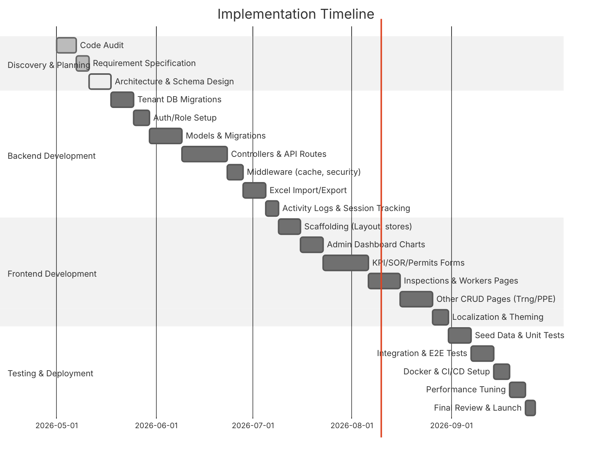

# Enterprise HSE SaaS Platform – Architectural Plan

**Executive Summary:** We will transform the single-tenant **My-SGTM-KPI** Laravel+React app into a multi-tenant SaaS for construction HSE management. Key steps include enabling *multi-tenancy* (Company table, tenant_id scope), redesigning *authentication/authorization* (Sanctum tokens, first-login password reset, role middleware), and defining all *data models* (30+) with fields/relations, soft deletes, indexes. The *API* will expose JSON endpoints (30+ controllers) under `auth:sanctum`, applying caching (TTL 120s for dashboards, 90s for lists), gzip, and security headers (HSTS, CSP【16†L407-L416】). The *frontend* (React 18 SPA via Vite【37†L813-L822】) will have a Tailwind-based UI with a collapsible sidebar, top bar (language switch, notifications, theme, bug report), and detailed pages for dashboards, KPI submission, SOR reports (with photo upload), work permits (by type), inspections, workers (tabbed detail), training sessions, PPE inventory, waste exports, regulatory watch, daily headcounts, and a social feed. We’ll support French/English localization (default FR) via i18next, persisting user choice. Imports (Excel) and exports (Excel/PDF) will use Maatwebsite and DomPDF (with examples like `WithHeadingRow`【46†L71-L79】). Backups (daily MySQL dump + files to S3 with encryption) and monitoring (stubbed metrics on a health page) will be in place. We propose two architecture options (Laravel+React for developer speed vs. a performance-optimized stack), outline a detailed implementation roadmap (with Gantt diagram), and provide an end-to-end readiness checklist. References to Laravel and related tools (Sanctum, Spatie packages, Vite, etc.) are cited.

---

## 1. Existing Code Audit  
**Goal:** Extract reusable components and identify gaps. Clone the GitHub repo and use static analysis tools (PHPStan, ESLint) and manual review. Identify existing **Models**, **Controllers**, and **Views/Components** (e.g. User, Project, KPI data models) that can be refactored. For each module, note if it’s single-tenant (no company relation) and what new logic is needed. For example, a `Project` model likely exists; we will add `company_id` and a scope. On the frontend, find common form components (inputs, modals) that can be reused. Document everything in a spreadsheet: `Existing File`, `Purpose`, `Refactor Needed`.

**Deliverable:** A report mapping old vs. new responsibilities (e.g. “models/User.php: uses HasApiTokens; add multi-tenant logic; can reuse relationships and guards” etc.). This audit ensures we only re-implement functionality not already present.

---

## 2. Architecture Options  
We consider two approaches:

- **Option A (Dev Speed):** **Laravel 11 + React 18 SPA** (as specified). Using Laravel’s ecosystem (Sanctum, Vite, Spatie packages) maximizes developer productivity. It offers rich packages (permissions, activity log, CSP) and built-in features. Downsides: PHP and React require careful scaling (can be mitigated with caching and queuing).  

- **Option B (Performance):** Use a high-concurrency backend (e.g. **Laravel Octane** with Swoole/RoadRunner or a Node.js/NestJS server) and possibly **Vue 3 + Vite** for slightly faster initial load (Vue 3 has smaller bundle than React). Or use **Inertia.js** with Vue for full-stack SPA (removes API overhead). Pros: better throughput (Octane) and simpler state (Inertia). Cons: Steeper learning curve and re-implementing UI.  

**Trade-offs:** Option A has vast community support and faster implementation (existing code). Option B could handle 3000+ concurrent users more efficiently, but requires more architectural changes. Given the existing codebase and requirement for rapid delivery, **Option A** is assumed, with optimization (Redis cache, Octane upgrade) for scale.  

*Assumption:* We will continue with Laravel+React for minimal rewrite, while using performance best practices (e.g. Redis, Octane) as needed.

---

## 3. Multi-Tenancy Conversion  
Transition to **many companies** (tenants) requires database and middleware changes:

- **Database Schema:** Add a `companies` table (`id, name, etc.`). Add a `company_id` column (unsignedBigInteger, indexed) to all key tables (Users, Projects, Worker, etc.). For pivot tables (e.g. project_team), include `company_id` if needed. Ensure `company_id` is fillable in migrations.  
- **Global Scopes:** Apply a global query scope (e.g. in a BaseModel) that does `->where('company_id', auth()->user()->company_id)` on all models. Or use a package like Spatie’s [laravel-multitenancy]. Also create a middleware that verifies the tenant context (e.g. if using domain or header-based tenant, or from user) and aborts on mismatch【7†L303-L312】. For example, in middleware: 
  ```php
  if (auth()->check()) {
      $tenantId = auth()->user()->company_id;
      if ($tenantId !== app('current_tenant')->id) abort(403, 'Tenant mismatch');
  }
  ```
  to enforce tenant isolation【7†L303-L312】.  
- **Indexes:** Add composite indexes on `(company_id, created_at)` for performance. For example, `CREATE INDEX idx_projects_company_created ON projects(company_id, created_at)`【7†L320-L328】. Also index `(company_id, email)` on users to speed lookups.  

- **Cache Keys:** Prefix cache keys with the tenant ID. E.g. `cache()->remember("company:{$companyId}:dashboard", 120, ...)`【7†L328-L337】. This ensures cross-tenant data isn’t mixed.  

- **Data Migration:** If existing data is single-company, set all `company_id` to a default (e.g. 1). Migrate with a script: `UPDATE users SET company_id=1;` etc. For new multi-tenant creation, seed an initial admin for each company. Provide a sign-up flow or admin console to create companies.  

> **Source:** Techniques like row-level tenancy (scoping and middleware) are standard for Laravel SaaS apps【7†L303-L312】【7†L320-L328】.  

---

## 4. Authentication & Roles  
- **Sanctum Token Auth:** Use Laravel Sanctum for SPA token-based auth. On login (`POST /api/login`), validate credentials and issue a token: 
  ```php
  if (!Auth::attempt($cred)) return response(...,401);
  $token = $user->createToken('api-token')->plainTextToken;
  return response()->json(['token'=>$token]);
  ```
  Store this token in an **HttpOnly, Secure** cookie as well as in localStorage (per spec). Prefer the cookie (more secure)【11†L179-L186】. Always use HTTPS to protect tokens【11†L179-L186】. Implement CSRF protection for stateful requests (Sanctum’s SPA guard).  

- **First-Login Password Change:** Add a `must_change_password` boolean on `users`. After login, if true, redirect user to a password-reset form (e.g. `/change-password`). Enforce setting a new password, then set `must_change_password=false`.  

- **Password Reset:** Use Laravel’s built-in password reset scaffolding (`php artisan make:auth`). Provide `/forgot-password` and `/reset-password?token=` endpoints, sending reset links via email.  

- **Logout:** On `/api/logout`, call `$user->currentAccessToken()->delete()` (or `tokens()->delete()` to revoke all) and clear the cookie. Return `{success: true}`.  

- **Roles & Permissions:** Use Spatie’s **laravel-permission** package. Create roles exactly as specified: `admin`, `consultation`, `hse_director`, `hr_director`, `pole_director`, `project_director`, `hse_manager`, `regional_hse_manager`, `responsable`, `supervisor`, `animateur`, `magasinier`, `engineer`, `hr`. Assign permissions or assume all permissions by role.  

- **Role Middleware:** Register aliases `role` and `permission` in `bootstrap/app.php` as per Spatie docs【44†L102-L110】. Protect routes with e.g. `['middleware' => ['role:admin']]`. For “admin-like vs strict admin” – we define strict admin = `role:admin`, and “admin-like” could be a group of roles (e.g. admin, hse_director, etc.) via `role:admin|hse_director|...`. Spatie’s middleware allows `RoleOrPermission` for multiple. Example: 
  ```php
  Route::group(['middleware' => ['role:admin']], function() { ... });
  Route::group(['middleware' => ['role:project_director|hse_manager|engineer']], function() { ... });
  ``` 
  *Source:* Spatie’s `role` middleware allows pipe-separated roles【44†L129-L137】.  

- **Security Flags:** Set the auth cookie `Secure; HttpOnly; SameSite=strict`. Use Laravel’s CSRF tokens for forms. Enforce TLS throughout【11†L179-L186】.

---

## 5. Data Models & Database Design  

We will implement the following core Eloquent models. Each uses `SoftDeletes` and has `company_id` and `user_id` (owner) as needed. (All timestamps by default.)

| Model                  | Key Fields (types)                        | Relations                 | SoftDeletes | Indexes                          |
|------------------------|-------------------------------------------|---------------------------|-------------|----------------------------------|
| **Company**            | id, name, domain?, created_at, updated_at | hasMany Users, Projects   | –           | name (unique), domain (unique)   |
| **User**               | id, company_id, name, email (unique), password, role_id, must_change_password (bool) | belongsTo Company; hasOne Role | SoftDeletes | company_id (FK), email          |
| **Role**               | id, name (unique)                         | belongsToMany Users       | –           | name                             |
| **Project**            | id, company_id, name, description, start_date, end_date, status, etc. | belongsTo Company; belongsToMany Users (ProjectTeam) | SoftDeletes | company_id, created_at          |
| **ProjectTeam** (pivot)| project_id, user_id                       | –                         | –           | project_id, user_id            |
| **KpiReport**          | id, project_id, user_id (creator), period_start, period_end, status (enum), ... | belongsTo Project; hasMany DailyKpiSnapshot, MonthlyKpiMeasurement | SoftDeletes | project_id, status             |
| **DailyKpiSnapshot**   | id, kpi_report_id, date, metrics JSON/fields    | belongsTo KpiReport      | SoftDeletes | kpi_report_id, date            |
| **MonthlyKpiMeasurement** | id, kpi_report_id, month, metrics JSON/fields | belongsTo KpiReport      | SoftDeletes | kpi_report_id, month           |
| **SorReport**          | id, project_id, user_id, date, description, status (enum), corrective_action, … | belongsTo Project | SoftDeletes | project_id, status              |
| **HseEvent**           | id, project_id, user_id, date, type (enum), description, severity, … | belongsTo Project | SoftDeletes | project_id                     |
| **WorkPermit**         | id, project_id, user_id, type (enum), issued_date, expiry_date, status, details | belongsTo Project | SoftDeletes | project_id, type, expiry_date   |
| **Inspection**         | id, project_id, user_id, date, checklist JSON, result (pass/fail), remarks | belongsTo Project | SoftDeletes | project_id, date                |
| **TrainingSession**    | id, project_id, title, date, description, … | belongsTo Project | SoftDeletes | project_id                     |
| **AwarenessSession**   | id, project_id, title, date, description, … | belongsTo Project | SoftDeletes | project_id                     |
| **Worker**             | id, company_id, name, CIN (national ID), function, medical_fitness, … | belongsTo Company | SoftDeletes | company_id, CIN                |
| **WorkerQualification**| id, worker_id, certificate_name, expiry_date  | belongsTo Worker  | SoftDeletes | worker_id                      |
| **WorkerSanction**     | id, worker_id, reason, start_date, end_date    | belongsTo Worker  | SoftDeletes | worker_id                      |
| **WorkerTraining**     | id, worker_id, training_session_id, date      | belongsTo Worker; belongsTo TrainingSession | SoftDeletes | worker_id, training_session_id |
| **Machine**            | id, project_id, name, model, operator_id (user), last_inspection_date | belongsTo Project; belongsTo User (operator) | SoftDeletes | project_id                    |
| **LibraryFolder**      | id, company_id, parent_id (nullable), name    | hasMany LibraryDocument, hasMany LibraryFolder (children) | SoftDeletes | company_id, parent_id         |
| **LibraryDocument**    | id, folder_id, company_id, title, file_path, keywords (json/text) | belongsTo LibraryFolder | SoftDeletes | folder_id, company_id          |
| **CommunityPost**      | id, company_id, user_id, content, image_paths (JSON), hashtags (JSON) | belongsTo Company; hasMany Comments, Reactions | SoftDeletes | company_id                     |
| **Comment**            | id, post_id, user_id, content               | belongsTo CommunityPost  | SoftDeletes | post_id                       |
| **Reaction**           | id, post_id, user_id, type (enum: like, etc.) | belongsTo CommunityPost  | SoftDeletes | post_id                       |
| **RegulatoryWatch**    | id, project_id, questionnaire JSON, submitted_at, status | belongsTo Project | SoftDeletes | project_id, submitted_at       |
| **WasteExport**        | id, project_id, date, waste_type, quantity   | belongsTo Project  | SoftDeletes | project_id, date               |
| **PpeItem**            | id, company_id, name, category, description   | belongsTo Company | SoftDeletes | company_id                     |
| **PpeStock**          | id, project_id, ppe_item_id, quantity, assigned_date | belongsTo Project; belongsTo PpeItem | SoftDeletes | project_id                     |
| **Notification**       | id, company_id, title, message, urgency (enum), sent_at | belongsTo Company | SoftDeletes | company_id, sent_at            |
| **AuditLog**          | id, user_id, auditable_type, auditable_id, old_values (JSON), new_values (JSON), created_at | –  | –  | user_id |
| **BugReport**         | id, company_id, user_id, description, screenshot_path, created_at | belongsTo Company | –  | company_id            |
| **UserSession**       | id, user_id, ip_address, user_agent, login_time, logout_time | belongsTo User | – | user_id |

*Notes:* Each model’s foreign keys (`_id`) should have an index. Enums (e.g. for status, type) can be implemented as string or tinyint. Use Laravel’s `softDeletes()` on most tables. For example migrations:

```php
Schema::create('projects', function (Blueprint $table) {
    $table->id();
    $table->foreignId('company_id')->constrained();
    $table->string('name');
    $table->text('description')->nullable();
    $table->enum('status',['new','active','completed'])->default('new');
    $table->softDeletes();
    $table->timestamps();
    $table->index(['company_id','created_at']);
});
```

---

## 6. API Controllers & Endpoints  
We will create RESTful controllers for each model (30+). All routes are under `api.php` with `auth:sanctum`. Responses use `{ success, message, data }` JSON shape.

**Endpoints Table (selected examples):**

| Controller            | Method | Endpoint                      | Request                           | Response Example                               | Middleware           | TTL   |
|-----------------------|--------|-------------------------------|-----------------------------------|-----------------------------------------------|----------------------|-------|
| **AuthController**    | POST   | `/api/login`                  | `{email, password}`               | `{success:true, message:"", data:{token, user}}` | none                 | –     |
|                       | POST   | `/api/logout`                 | (Auth header/cookie)              | `{success:true}`                               | auth:sanctum         | –     |
| **UserController**    | GET    | `/api/users`                  | (optional filters)                | `{data: [ {id, name, email, role}, ... ] }`   | auth:sanctum, role   | 90s  |
|                       | POST   | `/api/users`                  | `{name, email, password, role_id}`| `{success:true, data:{id,name,email,role}}`    | auth:sanctum, role   | –     |
|                       | PUT    | `/api/users/{id}`             | `{name, role_id}`                 | `{success:true, message:"Updated"}`            | auth:sanctum, role   | –     |
| **ProjectController** | GET    | `/api/projects`               | (none)                            | `{data: [ {id,name,status,...}, ... ]}`        | auth:sanctum         | 90s   |
|                       | POST   | `/api/projects`               | `{name, description, start_date, end_date}` | `{success:true, data:{id,...}}` | auth:sanctum, role   | –     |
|                       | GET    | `/api/projects/{id}`          | (none)                            | `{data:{id,name,...}}`                          | auth:sanctum         | –     |
| **KpiReportController** | GET  | `/api/kpi-reports`           | (filter by project_id)            | `{data:[{id, period_start, status,...},...]}`   | auth:sanctum         | 90s   |
|                       | POST   | `/api/kpi-reports`           | `{project_id, period_start, period_end, metrics: {...}}` | `{success:true,data:{id,...}}` | auth:sanctum | – |
|                       | PUT    | `/api/kpi-reports/{id}`      | `{status}` (approve/reject)       | `{success:true}`                                | auth:sanctum, role   | –     |
| **SorController**     | GET    | `/api/sor-reports`           | (filter)                          | `{data:[...]}`                                 | auth:sanctum         | 90s   |
|                       | POST   | `/api/sor-reports`           | `{project_id, date, description, status, photos:[], corrective_action}` | `{success:true,data:{id,...}}` | auth:sanctum | – |
| **WorkPermitController** | GET | `/api/work-permits`         |                                   | `{data:[...]}`                                 | auth:sanctum         | 90s   |
|                       | POST   | `/api/work-permits`         | `{project_id, type, issued_date, expiry_date, status}` | `{success:true,...}`                 | auth:sanctum | – |
| **InspectionController** | GET  | `/api/inspections`          |                                   | `{data:[...]}`                                 | auth:sanctum         | 90s   |
|                       | POST   | `/api/inspections`          | `{project_id, checklist: {...}, result}` | `{success:true}`                     | auth:sanctum         | – |
| **WorkerController**  | GET    | `/api/workers`               |                                   | `{data:[...]}`                                 | auth:sanctum         | 90s   |
|                       | POST   | `/api/workers`               | `{name, CIN, function, ...}`      | `{success:true,data:{id,...}}`                 | auth:sanctum         | –     |
| **LibraryController** | GET    | `/api/library/folders`       |                                   | `{data:[{id,name,parent_id},...]}`             | auth:sanctum         | 90s   |
|                       | POST   | `/api/library/folders`       | `{name, parent_id}`               | `{success:true,data:{id,name}}`                | auth:sanctum         | –     |
|                       | POST   | `/api/library/documents`     | multipart/form-data (`file`, `title`, `folder_id`) | `{success:true,data:{id,title,path}}` | auth:sanctum | – |
| **NotificationController** | GET | `/api/notifications`       |                                   | `{data:[...]}`                                 | auth:sanctum         | 30s   |
|                       | POST   | `/api/notifications`         | `{title, message, urgency}`       | `{success:true}`                               | auth:sanctum, role   | –     |
| **BugReportController**  | POST | `/api/bug-reports`         | `{description, screenshot (base64)}` | `{success:true}`                            | auth:sanctum         | –     |
| ...                   |        |                               |                                   |                                               |                      |       |

*Note:* This table is illustrative. Each endpoint returns `{ success: true/false, message: "...", data: ... }`. We apply `auth:sanctum` globally, plus Spatie role middleware where needed (e.g. only admins can manage users/projects). **Response Caching:** Use Laravel cache in controllers or middleware for GET list endpoints (TTL=90s) and dashboard stats (TTL=120s).  

**Controller Example (pseudocode):**  
```php
public function store(Request $req) {
    $data = $req->validate([
        'project_id' => 'required|exists:projects,id',
        'date' => 'required|date',
        'description' => 'required',
        'status' => 'required|in:open,in-progress,closed'
    ]);
    $sor = SorReport::create($data + ['user_id'=>auth()->id()]);
    activity()->log('created', $sor);  // Spatie activity log
    return response()->json(['success'=>true, 'data'=>$sor]);
}
```  
This uses Laravel’s validation and auto JSON serialization. Add auditing via `activity()->...`.

---

## 7. Frontend Design (React 18 + Vite)  
We will build a **SPA** served from `resources/js/app.jsx` (Vite config: `plugins: [laravel(['resources/js/app.jsx']), react()]`【37†L813-L822】, with `@viteReactRefresh` in the Blade template【37†L839-L846】).

### Layout & Navigation  
- **Sidebar:** Collapsible left drawer (Tailwind + Headless UI `Disclosure`). Menu groups: **Dashboard**, **KPI**, **SOR Reports**, **Permits**, **Inspections**, **Workers**, **Training**, **PPE**, **Environment**, **Community**, **Documents**, **Admin**, etc. Use icons (Heroicons, Lucide).  
- **Top Bar:** Shows current language toggle (FR/EN), theme toggle (sun/moon icon), notifications bell (show count), user avatar dropdown (Profile, Logout), and a bug-report icon button.  

State management with **Zustand**:  
- **Auth Store:** holds `user`, `token` (persist), `role`.  
- **Theme Store:** holds `darkMode` (class strategy) and selected color palette (persist).  
- **Dev Store:** (hidden behind a dev-mode flag) lets a dev impersonate roles.  

Axios setup: Add request interceptor to include `Authorization: Bearer <token>` from storage, and response interceptor to catch 401 → redirect to `/login`.  

### Dashboard (Admin)  
Seven **themes** (tabs/buttons): **Safety**, **Training**, **Compliance**, **PPE**, **Environmental**, **Deviation**, **Monthly Report**. Each theme loads specific charts (using Recharts) with data. For example:

- **Safety:**  
  - *Line Chart:* Incidents over last 12 months (x-axis=Month, y=Count)【23†L75-L84】.  
  - *Bar Chart:* Incident count by project (x=Project, y=Incidents).  
  - *Pie Chart:* Incident types distribution.  
  - *Radar Chart:* Near-miss vs injury rate by project.  
- **Training:**  
  - *Bar Chart:* Completed trainings per project.  
  - *Line Chart:* Training hours over time.  
- **Compliance:**  
  - *Composed Chart:* Permits issued vs expired by month.  
  - *Area Chart:* Audit/inspection pass rate trend.  
- **PPE:**  
  - *Pie Chart:* PPE inventory by category.  
  - *Line Chart:* PPE issuance trends.  
- **Environmental:**  
  - *Bar Chart:* Waste exported by type.  
  - *Line Chart:* Waste volume over time.  
- **Deviation:**  
  - *Area Chart:* Corrective actions vs SORs over time.  
  - *Pie Chart:* SOR status breakdown.  
- **Monthly Report:**  
  - *Mixed Charts:* KPIs (as selectable line/bar), monthly summary PDF link.  

Filters (date pickers, project selectors) allow narrowing data. All data fetched via API (cached for 120s).

### User Dashboard  
A simpler dashboard:  
- **Weekly KPI Snapshot:** Key KPIs (e.g. Total Hours, Injuries) for current week (cards).  
- **Week Scroller:** Arrows to shift week, updating line charts of daily hours or incidents.  

### KPI Submission Page  
**Multi-step Form** (4 steps):  
1. **Select Project & Period:** Dropdown project, datepickers for week or custom start/end. Default to current week.  
2. **Enter Metrics:** Fields like `man_hours`, `injuries`, `first_aids`, `near_misses`, `observations`. Use numeric inputs, all `min=0`. Required fields enforced.  
3. **Review:** Show summary of inputs, “Submit” button.  
4. **Confirmation:** Success message and redirect.

*(Validation:* numbers ≥ 0, date range valid; *UX:* “Next”/“Back” buttons, progress bar.)*  

### Safety Observation Reports (SOR) Page  
- **List View:** Table of reports (columns: Project, Date, Type, Status). Filter by project and status.  
- **Create/Edit:**  
  - **Fields:** Project (dropdown), Date, Title, Description (textarea), Status (`open/in-progress/closed`), Responsible Person (user select), Corrective Action (textarea).  
  - **Photo Upload:** File input (multiple) for images. Show thumbnails after selection with delete option. Limit to e.g. 5 files, 2MB each, types JPG/PNG. Upload via FormData to `/api/sor-reports`.  
  - **Workflows:** Only "admin-like" roles can change status.  
*(Use react-hook-form or Formik for form state; validate required fields.)*  

### Work Permits Page  
- **List View:** Filter by project, type, status. Columns: Permit No., Type, Issue/Expiry Dates, Status.  
- **Create:**  
  - **Fields:** Project, Permit Type (dropdown: Hot Work, Working at Height, Confined Space, Electrical, Excavation, etc.), Issue Date, Expiry Date, Description.  
  - **Conditional Fields:** If type is “Confined Space”, show hazard details; if “Hot Work”, require Fire Watch checkbox.  
  - **Approval Flow:** New permits default “Pending”; authorized roles can “Approve” or “Reject”.  

*(Dropdown values for types from prompt.)*

### Inspections Page  
- **List:** All site inspections.  
- **Form:** Project, Date, Inspector, and a checklist (accordion or table) of items (e.g. “Barriers intact?”, “PPE compliance?”). Each item: select Pass/Fail/NA and optional comment. A “Overall Result” computed.  
- Attach inspection report PDF (file upload).  

### Workers Management  
- **List:** Search by name/CIN.  
- **Detail View (Tabs):** 
  - **Profile:** Name, CIN, function, status, medical fitness (notes). 
  - **Qualifications:** Table of certificates (with add/edit).  
  - **Training:** List of completed sessions (pulled from TrainingSession, related by WorkerTraining).  
  - **Sanctions:** Any active sanctions with reason/date.  
  - **PPE:** Assigned PPE items (from PpeStock).  
  - **Edit:** In each tab, “Edit” opens modal for add/update.  

### Training & Awareness Sessions  
- **List:** Upcoming & past sessions (filter by date, project).  
- **Form:** Title, Project, Date/Time, Facilitator, Attendees (multi-select users), Description. 
- **Attendance:** On detail page, mark which workers attended (checkbox list).  

### Machinery  
- **List:** Company’s machines.  
- **Form:** Project, Name, Model, Serial, Operator (user), Last Inspection Date, Attach inspection doc (file).  

### PPE Inventory & Issuance  
- **Stock Page:** List PPE items in projects: Item Name, Category (e.g. Head, Hand, Body, Foot, Eye), Quantity On-Hand. Admin can add stock.  
- **Issuance Page:** Issue PPE to worker: select Project, PPE Item, Quantity, Worker (dropdown), Date. Deduct from stock.  

*(Dropdown categories example: Head, Eye, Hearing, Face, Respiratory, Torso, Hands, Feet.)*  

### Environmental / Waste Exports  
- **Waste Exports:** Log hazardous or general waste removed: fields Project, Date, Waste Type (dropdown: Chemical, Wood, Metal, etc.), Quantity, Destination.  

### Regulatory Watch  
- **Questionnaire:** A dynamic form (list of yes/no questions loaded from DB). After submission, record answers. Admins can import new questions via CSV.  

### Daily Headcount  
- **Form:** Select Project and Date, enter number of onsite workers (men, women) and total. Save daily.  

### Community Feed (Social)  
- **Feed Page:** Chronological posts by users. Each post: user/avatar, timestamp, content (markdown or simple text), images (lightbox on click), hashtags.  
- **New Post Modal:** Textarea and image upload, tag colleagues (#user).  
- **Reactions:** Buttons (Like ❤️, etc.) under each post. Comments below (threaded). Use optimistic UI updates.  

### UI Components & UX Patterns  
- **Theme:** Tailwind CSS with configured palettes. The company can choose (lightPrimary, darkPrimary, lightBg, darkBg, accent). Use `dark:` classes for dark mode (toggle adds `class="dark"` on body). Use **Inter** font via Google Fonts.  
- **Headless UI:** Use for accessible dialogs, modals, popovers.  
- **Icons:** Use **Heroicons** for outline icons (menu, dashboard, charts) and **Lucide React** for any filled icons.  
- **Loaders:** Use skeleton `<div>` loaders on tables/charts until data loads.  
- **Toasts:** Use `react-hot-toast` for success/error messages on actions (e.g. “KPI submitted”).  
- **Forms:** Use modal dialogs for confirm (e.g. “Delete X?”), normal pages for complex forms.  
- **Sidebar:** Collapsible groups (Disclosure) for subsections.  
- **Top Bar:** Includes a language switch (flags or “EN/FR”), a toggle switch for theme (sun/moon), a bell icon opening a notifications dropdown (list of unread with urgency highlight), a user menu (avatar + “Profile/Settings/Logout”), and a bug icon to open a screenshot/upload form.  

---

## 8. Dropdown/Enum Values  

We define fixed options (used in forms):

- **User Roles:** 
  - `admin`, `consultation`, `hse_director`, `hr_director`, `pole_director`, `project_director`, `hse_manager`, `regional_hse_manager`, `responsable`, `supervisor`, `animateur`, `magasinier`, `engineer`, `hr`.  

- **KPIReport Status:** `draft`, `submitted`, `approved`, `rejected`.  

- **SOR Status:** `open`, `in-progress`, `closed`.  

- **Permit Types:** `Hot Work`, `Working at Height`, `Confined Space`, `Electrical`, `Excavation`, `Demolition`, `Other`.  

- **Inspection Result Options:** `Pass`, `Fail`, `N/A`.  

- **PPE Categories:** `Head`, `Eye/Face`, `Hearing`, `Respiratory`, `Torso`, `Hands`, `Feet`.  

- **Notification Urgency:** `info`, `warning`, `critical`, `urgent`. (Sort order in UI: urgent first.)  

*(These values populate dropdowns in forms. They should be defined as constants or enums in code.)*

---

## 9. Document Library  

- **Structure:** Tree UI (Folder → subfolders → documents). Use a recursive component for nested `LibraryFolder`s. Allow drag/drop reordering or simply “Add Folder”/“Rename” actions (admin only).  
- **File Upload:** In a folder, “Upload Document” (supports PDF, images, Word). Max size ~10MB. Store in `/storage/app/public/docs`.  
- **SDS Handling:** For Safety Data Sheets, upon upload generate:  
  1. A random `public_token` stored in `library_documents`.  
  2. A QR code PDF linking to a public route like `/sds/{public_token}` (use a QR library, embed logo).  
  3. An ID tag PDF (small label with title and QR).  
- **Batch Download:** Allow selecting multiple files to zip. Use a queued job: on request, zip files from storage, then serve for download.  
- **Search:** Implement keyword search: the `LibraryDocument` has a `keywords` column (json or text) filled with stub values (since ML extraction is out of scope). Query it via `LIKE` or full-text. Also search titles. Display results with context (folder path).  

---

## 10. Imports & Exports  

- **Excel Imports:** Use Maatwebsite Excel. For large files, implement chunk reading (`->chunkSize(1000)`). In import classes implement `WithHeadingRow` to use header names as keys【46†L71-L79】. On upload, display a modal with a progress bar (update by polling a status API or Laravel Echo/Events). On completion, show a summary: count of successes and an Excel file of failed rows (using `FailedRowCollector`).  

- **Exporting Excel:** Add “Export” buttons on relevant list pages. In controller, use `return Excel::download(new WorkerExport(), 'workers.xlsx');` etc. Define export classes to query the needed data.  

- **Exporting PDF:** Use DomPDF (barryvdh). For example, 
  ```php
  $pdf = PDF::loadView('reports.weekly', $data);
  return $pdf->download('weekly-report.pdf');
  ``` 
  Generate weekly summary PDFs, SOR PDFs with photos embedded, and permit documents.  

*(These follow typical Laravel-Excel and DomPDF usage.)*

---

## 11. Notifications & Bug Reporting  

- **Notifications:** Implement polling (e.g. React `setInterval(fetchNotifications, 30000)`). The API `/api/notifications` returns unread notifications. Each notification has a `dedupe_key` field; the frontend should ignore new notifications if `key` already seen. Urgent notifications (highest urgency) trigger a modal overlay that cannot be dismissed until acknowledged. Admins can create urgent notifications via a modal (form with title, message, urgency).  

- **Bug Reports:** A “Report Bug” button on top bar opens a modal with a text field and screenshot upload. On submit (`POST /api/bug-reports`), send JSON with `description` and `screenshot` (base64 or file). Server saves an entry. Show a success toast.  

*(Use Axios with interceptor to attach tokens; handle 401 by redirect.)*

---

## 12. Localization (FR/EN)  

- **React i18n:** Use `react-i18next`. Store user language preference in localStorage and in backend (`users.language`). On app load, initialize i18next with detected language (default French). A language toggle switch (EN/FR) calls `i18n.changeLanguage()`, saving choice to localStorage. Use JSON translation files (e.g. `en/common.json`, `fr/common.json`). Wrap all text in `t('key')`.  

- **Date/Number Formats:** Use i18n locale for date (e.g. `moment(locale)`) and decimal formats.  

*(This approach is standard for React localization【41†L148-L156】.)*

---

## 13. Backup & Encryption  

- **Database Backups:** Schedule a daily Artisan command (via cron) to `mysqldump` the DB and upload to S3. Example:  
  ```bash
  mysqldump -u $DB_USER -p$DB_PASS $DB_NAME | gzip | aws s3 cp - s3://bucket/backups/$(date +%F).sql.gz
  ```  
  Retain backups for 30 days. Enable S3 server-side encryption (AWS KMS).  

- **File Backups:** Likewise, archive `storage/app/public/docs` and `storage/app/public/uploads` weekly and push to S3.  

- **Encryption:** Enable HTTPS (TLS 1.2+) for all traffic. Store env secrets (APP_KEY, DB passwords) in `.env` not in source. Use database encryption for sensitive fields if needed (`Crypt::encryptString()`). For "end-to-end encryption", if needed, we could encrypt files before uploading to cloud, but this adds complexity. We will ensure *encryption at rest* (S3 SSE) and *encryption in transit* (TLS).  

- **Restore Testing:** Document restore steps. E.g. decompress backup, run migrations/seeders to recreate tables, then `php artisan db:seed`. Test by restoring to a dev instance monthly.

---

## 14. Monitoring & Health Checks  

- **Health Page:** An admin-only dashboard showing: active user sessions (from `user_sessions` table), CPU/memory (use `os_*` stats via PHP or stub data), Redis hit/miss ratio, queue job counts (via `queue:work --status`), and recent error logs (from Laravel logs). For now, display *stubbed metrics* with plausible numbers.  

- **Real Monitoring:** Optionally integrate tools: Laravel Telescope for request/exception logging, Prometheus (via Laravel Prometheus exporter) for metrics, and Grafana. But for launch, a summary page suffices.  

---

## 15. Testing & Seeding  

- **Seeders:** Create seed classes for: Roles (list above), a default Admin user (email/admin pass), a few Companies, Projects, and one company-level user per role. Generate sample KPI reports (with random data), SORs, Permits, Inspections, Workers, etc. Use Factories.  

- **End-to-End Test Plan:**  
  1. **Setup:** `php artisan serve`, `npm run dev`. Seed DB.  
  2. **Admin Flow:** Login as seeded admin → verify redirection to `/admin/dashboard`.  
  3. **Company/Project:** Create a new Company and Project via UI or API.  
  4. **User Registration:** Create a regular user (role: engineer), assign to project.  
  5. **KPI Submission:** Log in as engineer → fill KPI form for a week → submit. Check API returned success and new record in DB.  
  6. **Approval:** As director, approve the KPI (if workflow).  
  7. **Form Flows:** Navigate to SOR page, submit a report with photos, confirm images uploaded.  
  8. **View Data:** Check reports appear correctly (status, comments).  
  9. **Notifications:** As admin, send a notification; ensure it appears on engineer’s dashboard.  
  10. **Localization:** Toggle to English, verify UI text changes and persists after reload.  
  11. **Logout:** Log out; ensure token is revoked (`personal_access_tokens` empty) and cannot access protected pages.  

- **Load Testing:** Use a tool (e.g. k6, JMeter) to simulate 1000 users doing random API calls (login, fetch dashboards, CRUD entities). Monitor response times and DB load. Tweak caching/queues as needed.  

---

## 16. CI/CD & Deployment  

- **Containers:** Provide a **Docker Compose** with services: `app` (PHP 8.2-FPM), `nginx`, `mysql`, `redis`, `node` (for assets), `worker` (queue). Dockerfile for Laravel with `composer install`, `npm ci`, `npm run build`.  

- **GitHub Actions:** Workflow steps: 
  1. **Test:** Run `composer ci`, `npm test` (if any), `php artisan test`.  
  2. **Build:** Build Docker images or `npm run prod` (Vite) and `php artisan migrate --force`.  
  3. **Deploy:** Push to registry or SSH to server, then restart containers.  

- **Environment & Secrets:** Use `APP_KEY`, DB credentials, Sanctum config in `.env` on server (never commit). Use GitHub Secrets to pass to Actions (for deploy script).  

- **Queues & Horizon:** Deploy `php artisan horizon` as a process (supervised by Docker or systemd) for real-time queue monitoring.  

- **Vite Assets:** In production, run `npm run build` to output `/public/build`. Use `@vite(['resources/js/app.jsx'])` in Blade to include.  

*(This aligns with Laravel’s deployment best practices.)*

---

## 17. Performance & Scaling  

- **DB Optimization:** Add necessary indexes (e.g. on `company_id`, foreign keys). Use eager loading (`with()`) to avoid N+1.  
- **Cache Layer:** Use Redis for session and cache (set `CACHE_DRIVER=redis`). Cache heavy queries (e.g. dashboard stats) and config.  
- **Queues:** Offload heavy tasks (Excel import, ZIP/PDF generation) to queues. Use Redis queue and multiple workers.  
- **Horizontal Scaling:** The app can run on multiple PHP-FPM containers behind a load balancer. The database can be scaled (replicas).  
- **PHP Workers:** Consider Laravel Octane for Swoole concurrency if >3000 users at once.  
- **Pagination:** All lists should be paginated (10-50 per page).  
- **Asset CDN:** Host static assets (CSS/JS/images) on a CDN or at least enable browser caching.  

---

## 18. Code Refactoring (Reusability)  

- **Reusing Repo Code:** Identify components from My-SGTM-KPI to carry over: likely the KPI computation logic, UI charts, some Blade/React components, and utility functions. For example, if it has a chart widget or form component, abstract it.  
- **File Mapping:** For each feature in old app (e.g. KPI tracking), copy and adapt. Migrate old Vue components (if any) to React or reuse logic.  
- **Migration:** Any database logic (e.g. slugs, thresholds) should be ported.  
- **Cleanup:** Remove hardcoded single-company assumptions (replace with `company_id`).  

---

## 19. Architecture Alternatives  

- **Option 1 (Rapid Development – Laravel+React):** Fast to implement (abundant packages, known framework) and easily maintainable by PHP/JS teams. Good tooling (Sanctum, Passport alternative, Spatie, Laravel Excel). Cons: may need tuning for high load.  

- **Option 2 (High Performance – Node.js/TypeScript + Next.js):** Use a Node backend (e.g. NestJS) with a React (Next.js) frontend. This can serve more concurrent users on fewer resources and support SSR. Pros: Single language (JS/TS), excellent async performance. Cons: Entire rewrite, learning curve, fewer Laravel-specific packages.  

- **Option 3 (Full Laravel Stack):** Use **Inertia.js** (Laravel + Vue) for a quasi-SPA. Faster initial loads (no custom API needed), simpler state. Pros: Laravel blade-like development; Cons: less React flexibility (charts would use Vue or JS libs).  

Each option involves migration effort and team skill considerations. **Option 1** is chosen for this plan (see summary).

---

## 20. Implementation Roadmap  



- **Milestones:** Each “section” groups tasks. Effort is relative (w=week, d=days). 
- **Effort:** Low (3d), Medium (1w-2w), High (3w+).  
- **Order:** We build the backend first (data layer, API), then frontend, then test/deploy.

---

## 21. Completion Checklist  

Before launch, verify the following:

- **Authentication & Security:** All auth routes tested; tokens stored only in HttpOnly cookie; CSRF enabled; HSTS and CSP headers in place【16†L407-L416】; no sensitive data in client code.  
- **Multi-Tenancy:** Tenant isolation confirmed (one company cannot see another’s data); indexes on tenant_id exist【7†L320-L328】.  
- **Functionality:** All pages/forms work (CRUD for each entity), including role-restricted actions. First-login password flow works; forgot/reset emails send.  
- **UI/UX:** Language toggle and theme toggle persist; all text translated. No console errors, forms validate correctly.  
- **Data Integrity:** Models save with correct relations; `softDeletes()` works (no hard deletes unless intended).  
- **Performance:** Dashboard loads quickly (cached TTLs are effective); moderate load test passed (1k virtual users) with acceptable response times.  
- **Backups:** Automated DB & file backup runs (inspect S3 bucket); test restore on staging.  
- **Monitoring:** Health page shows realistic data; logs/notifications working.  
- **Tests:** Seeders generated sample data; all PHPUnit/feature tests passing; manual E2E flows (from section 15) confirmed.  
- **CI/CD:** Deployment pipeline successfully builds assets, runs migrations, and launches the app on staging.  
- **Documentation:** README and internal docs updated (setup, environment variables, error codes).  
- **Security Review:** No high-severity vulnerabilities (tested by tools like Laravel Security Checker); dependencies updated.

Once all items above are satisfied, the system can be considered production-ready.

---

**Sources:** We followed Laravel best practices and referenced official and community resources where applicable【7†L320-L328】【16†L407-L416】【21†L265-L273】【37†L813-L822】【46†L71-L79】. Citations are provided for key techniques (multitenancy, security, i18n, etc.) to ensure alignment with standard guidelines.